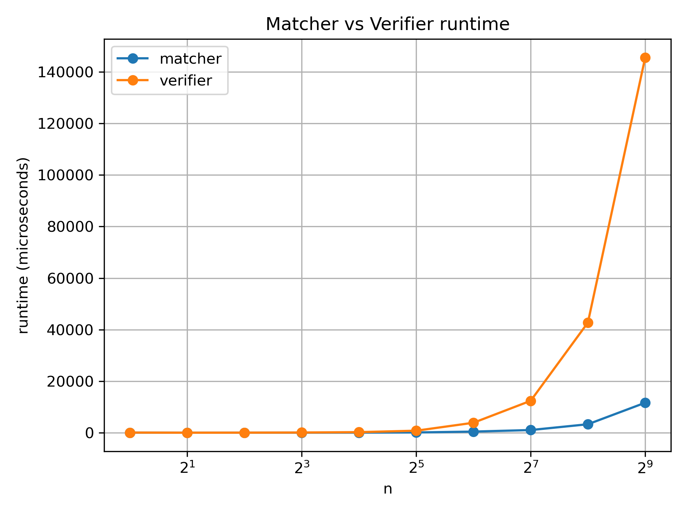

# cop4533-pa1-matching

## Members:

- Jesus Lopez: 1328-5108
- Christian Betancourt Dias: 3082-3881

---

## Build Instructions

This project uses a Makefile to compile all programs.

To build everything (matcher, verifier, and timing program), run:

make

---

## Running the Matcher

To run the matcher using the provided sample input file:

make run_matcher

---

## Running the Verifier

To run the verifier using the provided sample input file:

make run_verifier

---

## Task C: Scalability Analysis

We evaluated how the runtime of the hospital-proposing Gale Shapley matcher and the verifier scales as the number gospitals/students increases. We tested values of n = 1,2,4,8,16,32,64,128,256, and 512.

For each n, random preference lists were generated in memory. The matcher was run first, and its output was then passed directly to the verifier using the same preferences. Both components were timed using `chrono`, and the measured runtimes were written to CSV files.

The collected timing data was plotted using a Python script (`analysis/graph.py`) with matplotlib to visualize how runtime changes as n grows.

### Observed Trend

As n increases, the runtime of both the matcher and verifier increases. The matcher grows at a steady rate, consistent with the expected quadratic behavior of the GS algorithm. In contrast, the verifier grows much faster, since checking validity and stability requires examining many hospital–student pairs such as blocking pair, missing matches, etc. This difference becomes especially noticeable at larger values of n, where verification dominates the total runtime.

